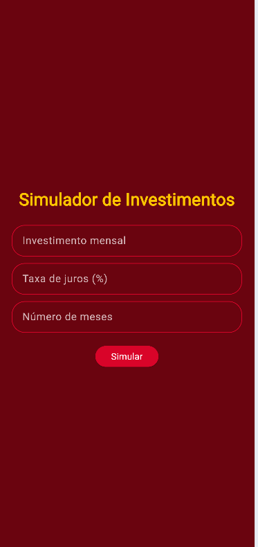
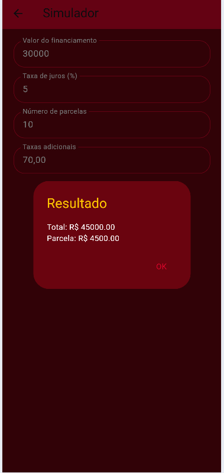

# ▶️ Como executar o projeto
1. Clone este repositório.
2. Abra o projeto no VS Code.
3. Instale as dependências:
```bash
flutter pub get
```
4. Execute o aplicativo:
 ```bash
flutter run
```
## 🖼 Pictures



